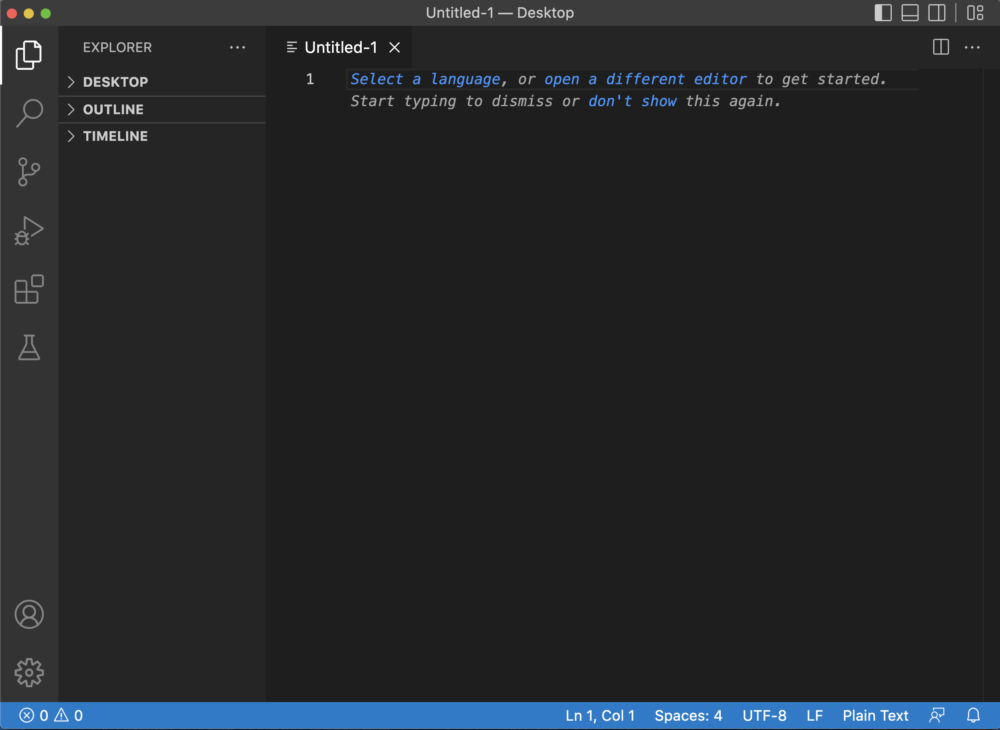
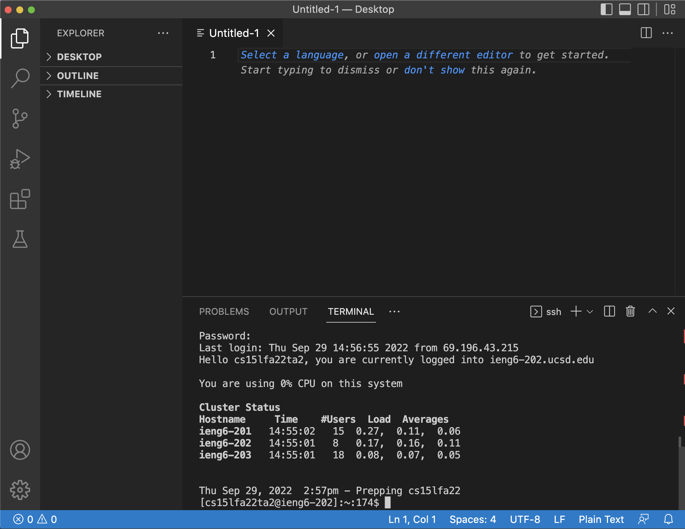
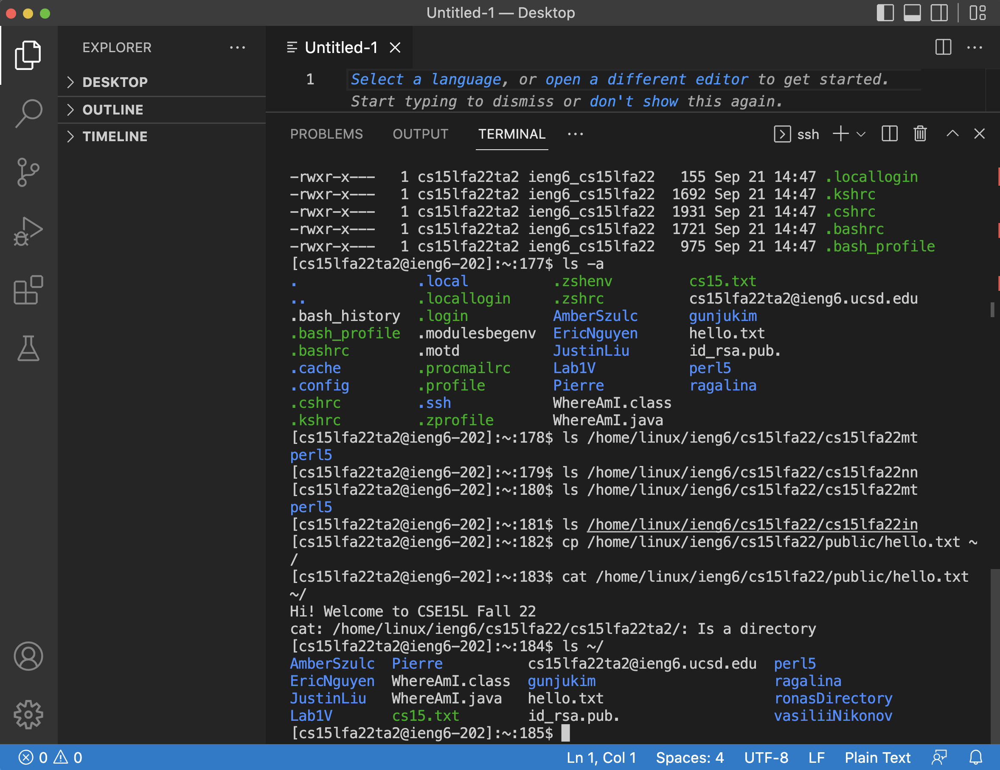
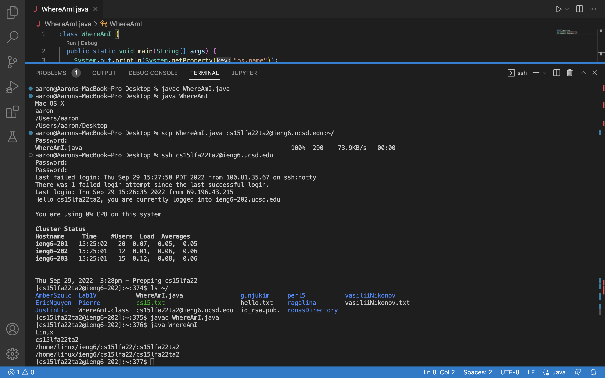
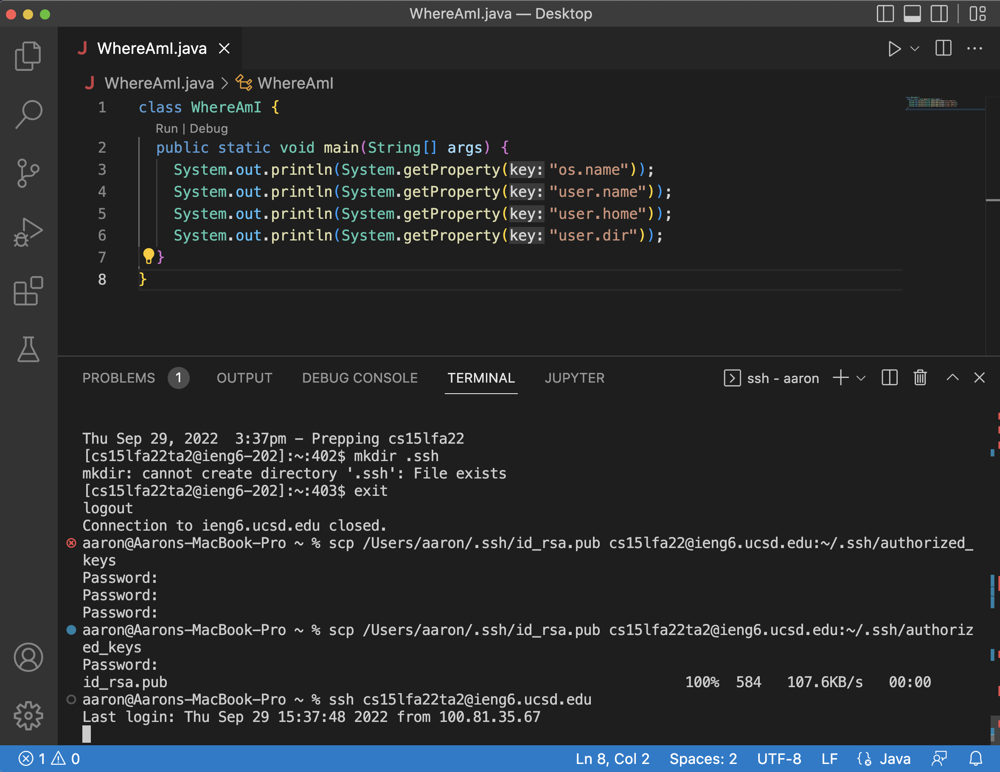
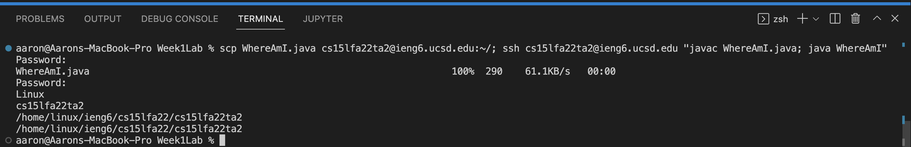

# How to login to your course-specific account!

## Step 1, VScode:
* Go to https://code.visualstudio.com/
* Follow the instructions to download VScode on your PC
* Once installed, open the software and you should see an Untitled page



## Step 2, Remotely Connecting
* Because I'm on a Mac, I'm able to use ssh without installing [OpenSSH](https://docs.microsoft.com/en-us/windows-server/administration/openssh/openssh_install_firstuse), windows users will need this however
* Press Ctrl + ` (tilde) in order to access the VScode terminal
* Type in `ssh cs15lfa22zz@ieng6.ucsd.edu`, but replace the zz with your unique account number

This is what it should look like after typing in the above command:


## Step 3, Trying Commands
* In this step, you have some freedom to experiement with the commands you've learned about
* Try using the commands you learned from lecture like...\
`cd` to change the directory you are currently in,\
`ls` to list the files and folders in your current directory,\
`cat` to print out the contents of a file or files that follow,\
and so on.

You can try using some of the commands from the screenshot below:


## Step 4, Moving Files Across Machines
* First, create a file called `WhereAmI.java` with the following contents (generously provided by Professor Politz):
```
class WhereAmI {
  public static void main(String[] args) {
    System.out.println(System.getProperty("os.name"));
    System.out.println(System.getProperty("user.name"));
    System.out.println(System.getProperty("user.home"));
    System.out.println(System.getProperty("user.dir"));
  }
}
```
* Then place it somewhere that you know the file path to (in my example, I put it on the Desktop)
* Run this scp command in the directory of your .java file, changing the appropriate parts as last time: `scp YourFile.java cs15lfa22zz@ieng6.ucsd.edu:~/`
* The file should now be on the ieng6 machine in the home directory, use the ssh command to login and see if it's there (using ls)!
* You can also use the `cat` command from earlier to see if the file contents are the same



## Step 5, Creating an SSH Key
* This step will show us how to avoid having to type our password everytime we want to login
* First run `ssh-keygen` on the client (aka your computer), you should see a bunch of text afterwards, the system is generating the key pair
* When prompted, simply press enter to set the key to the default path
* Now type the following commands to copy the public key to the server account (adjust accordingly)
    1. `ssh cs15lfa22zz@ieng6.ucsd.edu` logs onto server
    2. `mkdir .ssh` creates directory on the server
    3. `exit` to logout of the server and go back to the client
    4. `scp /Users/yourname/.ssh/id_rsa.pub cs15lfa22@ieng6.ucsd.edu:~/.ssh/authorized_keys` copies the key, make sure to adjust the /Users/ directory to match your default path



## Step 6, Faster Remote Running
* This step will show us how to quickly edit a file, copy it to the server, and then run it
* First we need to edit the file, we can use `vi YourFile.java` to enter editing mode
* Once that is done, simply paste `scp YourFile.java cs15lfa22zz@ieng6.ucsd.edu:~/; ssh cs15lfa22@ieng6.ucsd.edu "javac YourFile.java; java YourFile"`

Note: Normally you wouldn't need to put your password in for this step 
