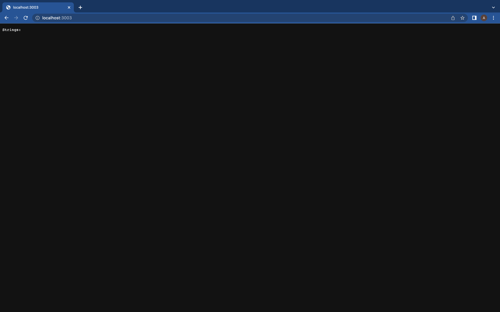
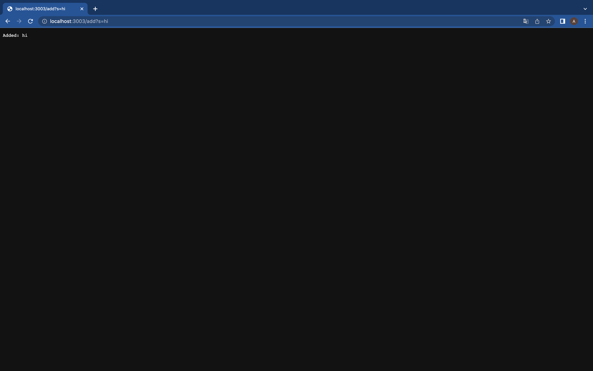
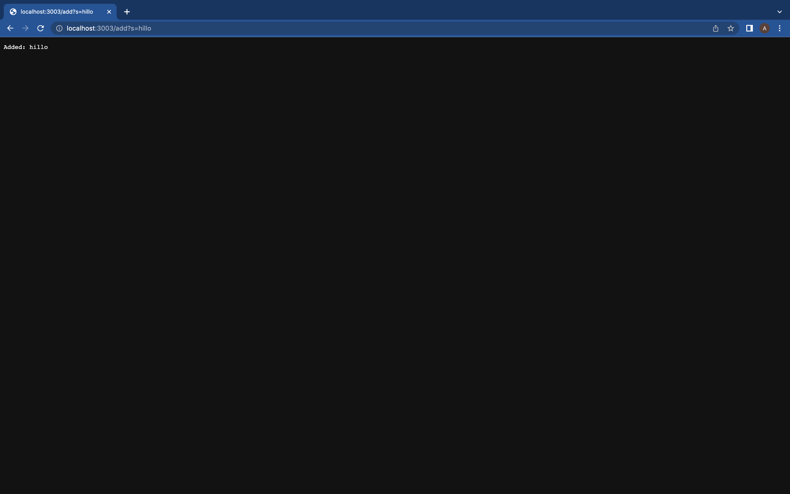
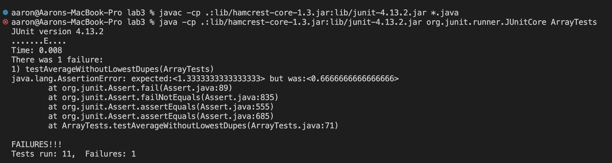
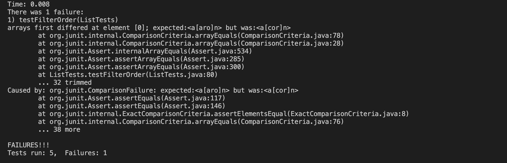

# Part 1: Simplest Search Engine

## Search Engine Code
```
import java.io.IOException;
import java.net.URI;
import java.util.ArrayList; 

class Handler implements URLHandler {
    // The one bit of state on the server: a number that will be manipulated by
    // various requests.
    ArrayList<String> strs = new ArrayList<String>();

    public String handleRequest(URI url) {
        if (url.getPath().equals("/")) {
            String display = "";
            for (String str : strs) {
                display += str + " ";
            }
            return String.format("Strings: %s", display);
        } else {
            System.out.println("Path: " + url.getPath());
            if (url.getPath().contains("/add")) {
                String[] parameters = url.getQuery().split("=");
                if (parameters[0].equals("s")) {
                    strs.add(parameters[1]);
                    return String.format("Added: %s", parameters[1]);
                }
            }
            else if (url.getPath().contains("/search")) {
                String[] parameters = url.getQuery().split("=");
                if (parameters[0].equals("s")) {
                    String display = "";
                    for (String str : strs) {
                        if(str.contains(parameters[1])) {
                            display += str + " ";
                        }
                    }
                    return String.format("Search yields: %s", display);
                }
            }
            return "404 Not Found!";
        }
    }
}

class SearchEngine {
    public static void main(String[] args) throws IOException {
        if(args.length == 0){
            System.out.println("Missing port number! Try any number between 1024 to 49151");
            return;
        }

        int port = Integer.parseInt(args[0]);

        Server.start(port, new Handler());
    }  
}
```

* Note: All functionality in the screenshots results from calls to the handleRequest method

## Screenshot of main page

* The first part of the if statement is called, which simply displays all stored strings
* The path in this case is simply `/`, and the strings array is empty here

## Screenshot of first add

* We enter the else of the first if statement, and then enter the inner if statement, which adds our query
* Our path is `/add?s=hi` and we look at storing the value `"hi"` in our array

## Screenshot of second add

* Same steps as screenshot above! Except with hillo instead of hi

## Screenshot of search page

* We enter the else of the first if statement, and then enter the inner else if statement, which displays the strings that correspond with our search criteria
* Our path is `/search?s=hil` and we search the array for the strings which contain `"hil"`

# Part 2: ArrayExamples, reverseInPlace

## Failure-inducing input
```
@Test
public void testAverageWithoutLowestDupes() {
    double[] input1 = { 1.0, 1.0, 1.0, 2.0 };
    assertEquals((1.0+1.0+2.0)/3.0, ArrayExamples.averageWithoutLowest(input1), 0);
}
```

## Symptom


## The code fix to the bug
```
static double averageWithoutLowest(double[] arr) {
    if(arr.length < 2) { return 0.0; }
    int lowestElement = 0;
    for(int i = 1; i < arr.length; i++) {
      if(arr[i] < arr[lowestElement]) { lowestElement = i; }
    }
    double sum = 0;
    for(int i = 0; i < arr.length; i++) {
      if(i != lowestElement) {
        sum += arr[i];
      }
    }
    return sum / (arr.length - 1);
}
```
* The symptom was caused by the method recognizing the lowest element even if there were dupes, excluding multiple values
* The new code only removes the exact element of the first lowest element

# Part 2: ListExamples, reverseInPlace

## Failure-inducing input
```
@Test 
public void testFilterOrder() {
    List<String> strList = new ArrayList<>();
    List<String> expectedList = new ArrayList<>();
    strList.add("aaron");
    strList.add("apple");
    strList.add("blueberry");
    strList.add("acorn");
    expectedList.add("aaron");
    expectedList.add("apple");
    expectedList.add("acorn");
    StringChecker sc = new strContains("a");
    assertArrayEquals(expectedList.toArray(), ListExamples.filter(strList, sc).toArray());
}
```

## Symptom


## The code fix to the bug
```
static List<String> filter(List<String> list, StringChecker sc) {
    List<String> result = new ArrayList<>();
    for(String s: list) {
      if(sc.checkString(s)) {
        result.add(s);
      }
    }
    return result;
}
```
* The symptom was caused because of the list ordering, the method was adding the new elements to the beginning of the list, not the end
* The new code adds elements to the end of the list


