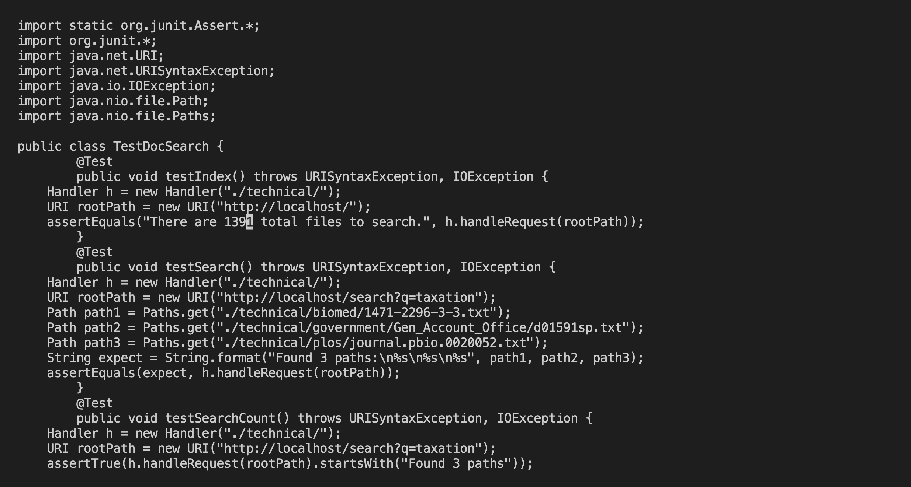

# Edits with Vim

## Part 1: Vim Commands for Changing TestDocSearch.java
* Our group originally used: / + 1 + enter + c + w + command + v + esc
* This would assume that the user has copied the edit beforehand, without copying beforehand, the command would be: / + 1 + enter + c + w + 1 + 3 + 9 + 1 + esc
* The proper sequence, including saving, is as follows:
`/1<Enter>cw1391<Esc>:w<Enter>`

* "/" and "1" are typed

* Pressing Enter results in jumping to the first appearance of 1, which is where we want to edit

* Typing "cw" tells the computer that we want to change the current word, we are now in insert mode

* We make the edit to the test, so that the file now says 1391 instead of 10
* We press Esc when we are done

* Typing ":w" and Enter will save our changes to the file

## Part 2: Editing Styles Compared

Method 1: Making the edit locally using VScode, then copying the file to the remote server and running the test script
* Time took: 55 seconds
* For this method, it took me extra time remembering which directory to switch into and then typing it out manually
* Besides the scp command, everything else was typed manually

Method 2: While on the remote server, making the edit using vim, then running the test script
* Time took: 38 seconds
* Following the style of the first method, everything was typed manually

My Style Preference:
I would likely prefer the first method if I was making many changes since I’m more comfortable using VScode. However, if I had more practice with vim or only needed to make a few changes, the second method would work better.

Some other factors that could influence which method I choose include:
* If I have an ssh key or not. If not, I wouldn’t use the first method probably
* If I have gone through the project files before and utilize past commands with the arrow keys, the first method would most likely be faster
