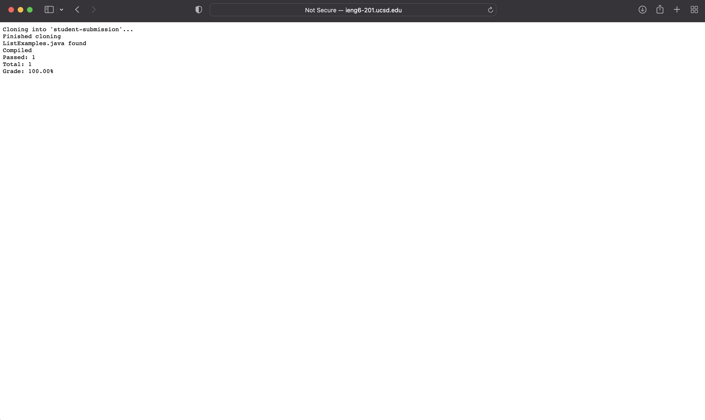
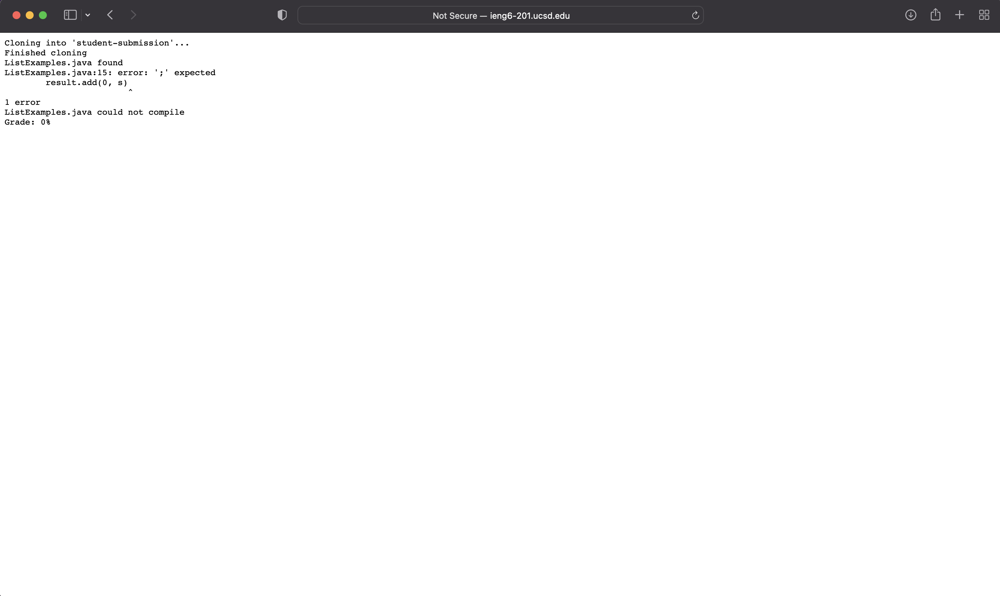

# My grading script file

```
# Create your grading script here
FILENAME="ListExamples.java"
CPATH=".:../lib/hamcrest-core-1.3.jar:../lib/junit-4.13.2.jar"

rm -rf student-submission
git clone $1 student-submission
echo 'Finished cloning'

cd student-submission
if [ -e $FILENAME ]
then
    echo "$FILENAME found"
else
    echo "$FILENAME not found"
    echo "Grade: 0%"
    exit
fi
cd ..

cp TestListExamples.java student-submission
cd student-submission
# echo "$PWD"

javac -cp $CPATH $FILENAME
if [ $? -ne 0 ]
then
    echo "$FILENAME could not compile"
    echo "Grade: 0%"
    exit
else
    echo "Compiled"
fi
javac -cp $CPATH TestListExamples.java

java -cp $CPATH org.junit.runner.JUnitCore TestListExamples | grep "Tests" > testResults.txt
OUTPUT=(`grep -o '[0-9]' < testResults.txt`)
PASSED=${OUTPUT[0]}
TOTAL=${OUTPUT[1]}
echo "Passed: $PASSED"
echo "Total: $TOTAL"
GRADE=$(bc <<< "scale=2 ; ($PASSED / $TOTAL)*100")
echo "Grade: $GRADE%"
```

# Screenshots of grading script running
* These 3 examples are from the first 3 student submission examples on the list

1. https://github.com/ucsd-cse15l-f22/list-methods-lab3


2. https://github.com/ucsd-cse15l-f22/list-methods-corrected


3. https://github.com/ucsd-cse15l-f22/list-methods-compile-error


# Tracing the 3rd example (compile error)

* Each command and if statement that is run has an explanation to the side of it
* Those lines which don't run are identified in the explanations
* Explanations are surrounded by ()

```
# Create your grading script here
FILENAME="ListExamples.java"
CPATH=".:../lib/hamcrest-core-1.3.jar:../lib/junit-4.13.2.jar"
 
rm -rf student-submission (this line produces no std out or err, the return code is 0)
git clone $1 student-submission (this line produces std err which is “Cloning into 'student-submission'...”, the return code is 0)
echo 'Finished cloning' (this line has std out that says “Finished cloning”, the return code is 0)
 
cd student-submission (this line produces no std out or err, the return code is 0)
if [ -e $FILENAME ] (this condition was true because a path that contains $FILENAME, the ListExamples.java file, was correctly found)
then
   echo "$FILENAME found" (this line has std out that says “ListExamples.java found”, the return code is 0)
else (the following lines in the else do not run because the then section is executed)
   echo "$FILENAME not found"
   echo "Grade: 0%"
   exit
fi
cd .. (this line produces no std out or err, the return code is 0)
 
cp TestListExamples.java student-submission (this line produces no std out or err, the return code is 0)
cd student-submission (this line produces no std out or err, the return code is 0)
# echo "$PWD"
 
javac -cp $CPATH $FILENAME (this line produces the following err:
ListExamples.java:15: error: ';' expected
        	result.add(0, s)
                        	^
1 error
	And has a return code that is nonzero)
if [ $? -ne 0 ] (this if statement evaluates to true, because our exit code from the previous line is nonzero, so not equal to 0)
then
   echo "$FILENAME could not compile" (this line has std out that says “ListExamples.java could not compile”, and return code 0)
   echo "Grade: 0%" (this line has std out that says “Grade: 0%”, and return code 0)
   exit (this line has no std or err, and is when we exit the code, so everything after this line is not run)
else
   echo "Compiled"
fi
javac -cp $CPATH TestListExamples.java

java -cp $CPATH org.junit.runner.JUnitCore TestListExamples | grep "Tests" > testResults.txt
OUTPUT=(`grep -o '[0-9]' < testResults.txt`)
PASSED=${OUTPUT[0]}
TOTAL=${OUTPUT[1]}
echo "Passed: $PASSED"
echo "Total: $TOTAL"
GRADE=$(bc <<< "scale=2 ; ($PASSED / $TOTAL)*100")
echo "Grade: $GRADE%"
```
